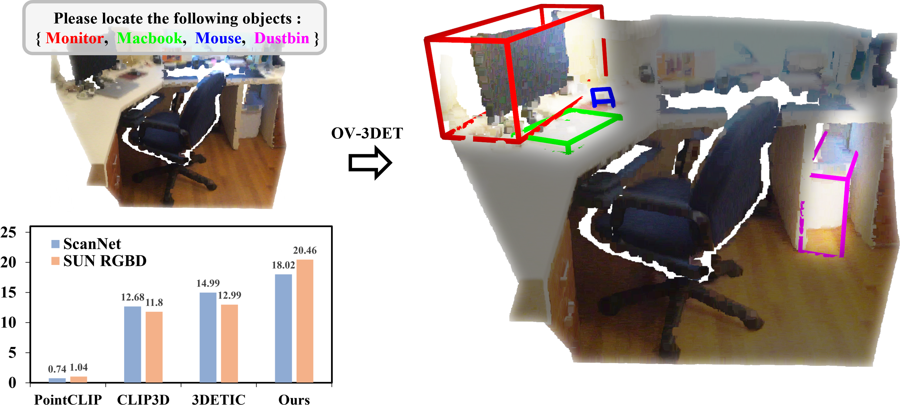

# OV-3DET: Open-Vocabulary Point-Cloud Object Detection without 3D Annotation

**OV-3DET**: An **O**pen **V**ocabulary **3**D **DET**ector. 

[Paper](https://arxiv.org/abs/2304.00788) | [BibTeX](#citation)

 <p align="center">  </p>

>[**OV-3DET: Open-Vocabulary Point-Cloud Object Detection without 3D Annotation**](https://arxiv.org/abs/2304.00788),                                                
>Yuheng Lu, Chenfeng Xu, Xiaobao Wei, Xiaodong Xie, Masayoshi Tomizuka, Kurt Keutzer and Shanghang Zhang,                                                               
>Accepted to *CVPR2023*                                                 
 
 ## Features
- Detects 3D objects according to text prompting.

- The training of OV-3DET does not require 3D annotation.


## Installation
See [installation instructions](https://github.com/lyhdet/OV-3DET/blob/main/Installation.md).


##  Training OV-3DET
### Phase 1 
Learn to Localize 3D Objects from 2D Pretrained Detector:
~~~
bash scannet_train_loc.sh
~~~

### Phase 2 
Learn to Classify 3D Objects from 2D Pretrained vision-language Model:
~~~
bash scannet_train_dtcc.sh
~~~

##  Evaluate OV-3DET
To evaluate OV-3DET, simply by running: 
~~~
bash scripts/evaluate.sh
~~~

## Acknowledgement
This codebase is modified base on ***3DETR*** [1], ***CLIP*** [2] and ***Detic*** [3], we sincerely appreciate their contributions!

>[1] An end-to-end transformer model for 3d object detection. *ICCV*. 2021.                                                                                             
>[2] Learning transferable visual models from natural language supervision. *ICML*. 2021.                                                              
>[3] Detecting twenty-thousand classes using image-level supervision. *ECCV*. 2022.                                                                                             

## Citation
If you find this repository helpful, please consider citing our work:

```
@article{lu2023open,
  title={Open-Vocabulary Point-Cloud Object Detection without 3D Annotation},
  author={Lu, Yuheng and Xu, Chenfeng and Wei, Xiaobao and Xie, Xiaodong and Tomizuka, Masayoshi and Keutzer, Kurt and Zhang, Shanghang},
  booktitle={Proceedings of the IEEE/CVF Conference on Computer Vision and Pattern Recognition},
  year={2023}
}
```
